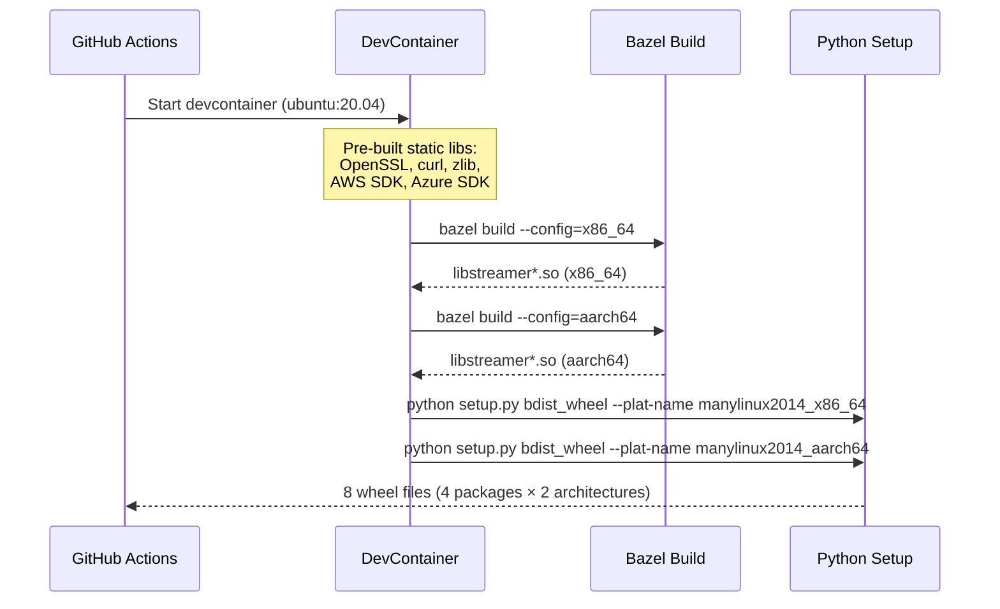
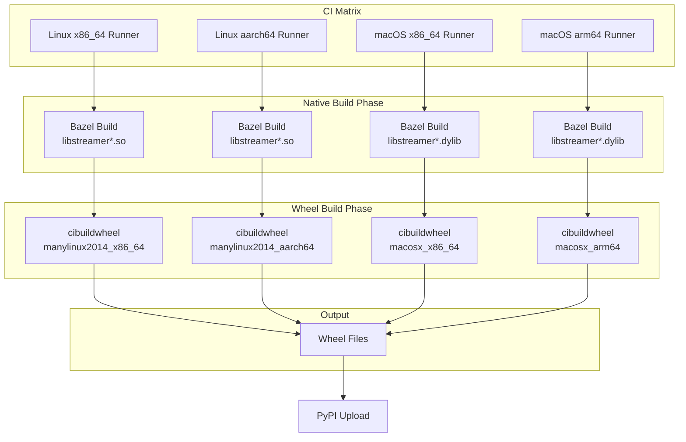

# Design: Cross-Platform Wheel Builds with cibuildwheel

**Issue:** #1  
**Author:** KAI Agent  
**Status:** Draft  
**Created:** 2026-02-19  

## Problem Statement

The runai-model-streamer package currently only provides wheels for Linux platforms (manylinux2014_x86_64 and manylinux2014_aarch64). Users on macOS cannot install the package, receiving errors like:

```
No solution found when resolving dependencies:
  Because all versions of runai-model-streamer have no wheels with a matching platform tag 
  (e.g., `macosx_15_0_arm64`) and you require runai-model-streamer, we can conclude
  that your requirements are unsatisfiable.
```

The current build system uses a custom devcontainer with complex cross-compilation setup, building all native dependencies (OpenSSL, curl, zlib, AWS SDK, Azure SDK, etc.) from source. This approach:

1. **Limits platform support** - Only Linux is supported; macOS/Windows users cannot use the package
2. **Has high maintenance burden** - The 200+ line Dockerfile requires manual updates for each dependency
3. **Is non-standard** - Doesn't follow Python packaging best practices, making it harder for contributors

## Goals

1. **Enable macOS wheel builds** - Support macOS x86_64 and arm64 platforms
2. **Adopt cibuildwheel** - Use the standard Python wheel building tool for cross-platform builds
3. **Maintain Linux support** - Continue supporting manylinux2014 for x86_64 and aarch64
4. **Simplify CI configuration** - Replace custom devcontainer build with declarative cibuildwheel config
5. **Preserve backward compatibility** - Existing Linux users should see no change in behavior

## Non-Goals

1. **Windows support** - Windows wheels are out of scope for this initial implementation (can be added later)
2. **musllinux support** - Alpine Linux support is deferred to a future enhancement
3. **Changing the native library architecture** - The C++ code and Bazel build system remain unchanged
4. **Modifying the Python API** - No changes to the Python interface

## Background: Current Architecture

### Package Structure

The project produces four Python packages, each bundling native shared libraries:

| Package | Native Library | Dependencies |
|---------|---------------|--------------|
| `runai-model-streamer` | `libstreamer.so` | Core streamer (minimal deps) |
| `runai-model-streamer-s3` | `libstreamers3.so` | AWS SDK, OpenSSL, curl, zlib |
| `runai-model-streamer-gcs` | `libstreamergcs.so` | Google Cloud C++ SDK |
| `runai-model-streamer-azure` | `libstreamerazure.so` | Azure SDK, OpenSSL, curl, libxml2 |

### Current Build Flow



### Key Challenges for Cross-Platform Builds

1. **Native dependencies** - The C++ libraries link against platform-specific SDKs
2. **Static vs dynamic linking** - Current build statically links dependencies to avoid runtime issues
3. **Cross-compilation complexity** - macOS requires different toolchains and SDK paths
4. **Bazel configuration** - Build system is configured for Linux cross-compilation only

## Design

### Approach: Hybrid Build Strategy

After evaluating several alternatives (see below), the recommended approach is a **hybrid strategy**:

1. **Use cibuildwheel** for orchestration and wheel packaging
2. **Pre-build native libraries** in platform-specific CI jobs
3. **Use cibuildwheel's `before-build`** to copy pre-built libraries into place

This approach leverages cibuildwheel's strengths (wheel repair, platform detection, PyPI compatibility) while accommodating the complex native build requirements.

### Architecture Overview



### Implementation Details

#### 1. New Workflow Structure

Replace the current single-job workflow with a matrix-based approach:

```yaml
# .github/workflows/on-release.yaml
name: Build and Release

on:
  release:
    types: [created]

jobs:
  build-native:
    name: Build Native Libraries
    strategy:
      matrix:
        include:
          - os: ubuntu-latest
            arch: x86_64
            artifact: linux-x86_64
          - os: ubuntu-latest  # Uses QEMU for aarch64
            arch: aarch64
            artifact: linux-aarch64
          - os: macos-13  # Intel Mac
            arch: x86_64
            artifact: macos-x86_64
          - os: macos-14  # Apple Silicon
            arch: arm64
            artifact: macos-arm64
    runs-on: ${{ matrix.os }}
    steps:
      - uses: actions/checkout@v4
      
      - name: Setup Build Environment
        run: |
          # Platform-specific dependency installation
          # (see detailed scripts below)
      
      - name: Build Native Libraries
        run: |
          cd cpp
          bazel build --config=${{ matrix.arch }} \
            streamer:libstreamer \
            s3:libstreamers3 \
            gcs:libstreamergcs \
            azure:libstreamerazure
      
      - name: Upload Native Libraries
        uses: actions/upload-artifact@v4
        with:
          name: native-${{ matrix.artifact }}
          path: cpp/bazel-bin/**/*.so cpp/bazel-bin/**/*.dylib

  build-wheels:
    name: Build Wheels
    needs: build-native
    strategy:
      matrix:
        include:
          - os: ubuntu-latest
            cibw_archs: x86_64
            native_artifact: linux-x86_64
          - os: ubuntu-latest
            cibw_archs: aarch64
            native_artifact: linux-aarch64
          - os: macos-13
            cibw_archs: x86_64
            native_artifact: macos-x86_64
          - os: macos-14
            cibw_archs: arm64
            native_artifact: macos-arm64
    runs-on: ${{ matrix.os }}
    steps:
      - uses: actions/checkout@v4
      
      - name: Download Native Libraries
        uses: actions/download-artifact@v4
        with:
          name: native-${{ matrix.native_artifact }}
          path: native-libs/
      
      - name: Build Wheels with cibuildwheel
        uses: pypa/cibuildwheel@v2.22
        with:
          package-dir: py/runai_model_streamer
        env:
          CIBW_ARCHS: ${{ matrix.cibw_archs }}
          CIBW_BEFORE_BUILD: |
            cp native-libs/libstreamer* {package}/runai_model_streamer/libstreamer/lib/
      
      - uses: actions/upload-artifact@v4
        with:
          name: wheels-${{ matrix.os }}-${{ matrix.cibw_archs }}
          path: wheelhouse/*.whl
```

#### 2. cibuildwheel Configuration

Create a `pyproject.toml` configuration for cibuildwheel:

```toml
# pyproject.toml (in repository root)
[build-system]
requires = ["setuptools>=61.0", "wheel"]
build-backend = "setuptools.build_meta"

[tool.cibuildwheel]
# Build for CPython 3.9-3.12
build = "cp39-* cp310-* cp311-* cp312-*"

# Skip 32-bit builds and PyPy
skip = "*-win32 *-manylinux_i686 pp*"

# Linux-specific configuration
[tool.cibuildwheel.linux]
# Use manylinux2014 for broad compatibility
manylinux-x86_64-image = "manylinux2014"
manylinux-aarch64-image = "manylinux2014"

# Repair wheels to bundle shared libraries correctly
repair-wheel-command = "auditwheel repair -w {dest_dir} {wheel}"

# Environment for builds
environment = { RUNAI_NATIVE_LIB_PATH = "/native-libs" }

before-build = """
mkdir -p {package}/runai_model_streamer/libstreamer/lib/
cp $RUNAI_NATIVE_LIB_PATH/*.so {package}/runai_model_streamer/libstreamer/lib/
"""

[tool.cibuildwheel.macos]
# Repair wheels for macOS
repair-wheel-command = "delocate-wheel --require-archs {delocate_archs} -w {dest_dir} {wheel}"

environment = { RUNAI_NATIVE_LIB_PATH = "/native-libs" }

before-build = """
mkdir -p {package}/runai_model_streamer/libstreamer/lib/
cp $RUNAI_NATIVE_LIB_PATH/*.dylib {package}/runai_model_streamer/libstreamer/lib/
"""

# Test the built wheels
[tool.cibuildwheel.test]
requires = ["pytest", "torch"]
command = "pytest {package}/tests -v --ignore=tests/s3 --ignore=tests/azure --ignore=tests/gcs"
```

#### 3. macOS Build Environment Setup

For macOS, dependencies need to be installed via Homebrew or built from source:

```bash
# scripts/setup-macos-build.sh
#!/bin/bash
set -e

# Install build tools
brew install bazelisk cmake

# Install native dependencies (will be statically linked)
brew install openssl@3 curl

# Set up environment for Bazel
export OPENSSL_ROOT_DIR=$(brew --prefix openssl@3)
export CURL_ROOT_DIR=$(brew --prefix curl)

# AWS SDK (build from source for static linking)
git clone --depth 1 --branch 1.11.584 https://github.com/aws/aws-sdk-cpp
cd aws-sdk-cpp
cmake -B build \
  -DBUILD_ONLY="s3-crt" \
  -DCMAKE_BUILD_TYPE=Release \
  -DBUILD_SHARED_LIBS=OFF \
  -DCMAKE_INSTALL_PREFIX=/opt/aws-sdk
cmake --build build --parallel
cmake --install build
cd ..

# Azure SDK (build from source)
git clone --depth 1 https://github.com/Azure/azure-sdk-for-cpp
cd azure-sdk-for-cpp
git checkout azure-storage-blobs_12.15.0
# Build similar to Linux devcontainer...
```

#### 4. Bazel Configuration Updates

Add macOS platform configurations to `.bazelrc`:

```bash
# cpp/.bazelrc additions

# macOS x86_64 configuration
build:macos_x86_64 --platform_suffix=macos_x86_64
build:macos_x86_64 --cpu=darwin_x86_64
build:macos_x86_64 --apple_platform_type=macos

# macOS arm64 configuration  
build:macos_arm64 --platform_suffix=macos_arm64
build:macos_arm64 --cpu=darwin_arm64
build:macos_arm64 --apple_platform_type=macos

# Common macOS options
build:macos --cxxopt=-std=c++17
build:macos --linkopt=-framework --linkopt=Security
build:macos --linkopt=-framework --linkopt=CoreFoundation
```

#### 5. Library Loading Updates

Update the Python library loader to handle `.dylib` on macOS:

```python
# py/runai_model_streamer/runai_model_streamer/libstreamer/__init__.py
import os
import sys
import ctypes

def _get_library_name():
    """Get platform-appropriate library name."""
    if sys.platform == "darwin":
        return "libstreamer.dylib"
    return "libstreamer.so"

DEFAULT_STREAMER_LIBRARY = os.path.join(
    os.path.dirname(os.path.abspath(__file__)), 
    f"lib/{_get_library_name()}"
)
STREAMER_LIBRARY = os.environ.get("STREAMER_LIBRARY", DEFAULT_STREAMER_LIBRARY)
```

### File Changes Summary

| File | Change Type | Description |
|------|-------------|-------------|
| `.github/workflows/on-release.yaml` | **Replace** | New matrix-based workflow with cibuildwheel |
| `.github/workflows/on-pr.yaml` | **Modify** | Add wheel build verification for PRs |
| `pyproject.toml` | **Create** | cibuildwheel configuration |
| `cpp/.bazelrc` | **Modify** | Add macOS platform configurations |
| `cpp/toolchain/` | **Modify** | Add macOS toolchain definitions |
| `py/*/setup.py` | **Modify** | Support `.dylib` extension on macOS |
| `py/*/__init__.py` | **Modify** | Platform-aware library loading |
| `scripts/setup-macos-build.sh` | **Create** | macOS dependency setup script |
| `.devcontainer/` | **Keep** | Retain for local development (optional) |

## Examples

### Example 1: Basic macOS Installation (After Implementation)

```bash
# On macOS arm64 (Apple Silicon)
$ pip install runai-model-streamer
Collecting runai-model-streamer
  Downloading runai_model_streamer-0.14.0-cp311-cp311-macosx_14_0_arm64.whl (2.1 MB)
Successfully installed runai-model-streamer-0.14.0

# Verify it works
$ python -c "from runai_model_streamer import SafetensorsStreamer; print('OK')"
OK
```

### Example 2: Installing with S3 Support on macOS

```bash
$ pip install runai-model-streamer[s3]
Collecting runai-model-streamer[s3]
  Downloading runai_model_streamer-0.14.0-cp311-cp311-macosx_14_0_arm64.whl (2.1 MB)
Collecting runai-model-streamer-s3==0.14.0
  Downloading runai_model_streamer_s3-0.14.0-cp311-cp311-macosx_14_0_arm64.whl (5.8 MB)
```

### Example 3: CI Build Output (Expected)

```
Build Matrix Results:
├── linux-x86_64
│   ├── runai_model_streamer-0.14.0-cp39-cp39-manylinux2014_x86_64.whl
│   ├── runai_model_streamer-0.14.0-cp310-cp310-manylinux2014_x86_64.whl
│   ├── runai_model_streamer-0.14.0-cp311-cp311-manylinux2014_x86_64.whl
│   └── runai_model_streamer-0.14.0-cp312-cp312-manylinux2014_x86_64.whl
├── linux-aarch64
│   └── ... (same pattern)
├── macos-x86_64
│   ├── runai_model_streamer-0.14.0-cp39-cp39-macosx_10_9_x86_64.whl
│   └── ...
└── macos-arm64
    ├── runai_model_streamer-0.14.0-cp39-cp39-macosx_11_0_arm64.whl
    └── ...
```

### Example 4: Local Development (Unchanged)

Developers can still use the devcontainer for Linux development:

```bash
# Start devcontainer
$ devcontainer up --workspace-folder .

# Build and test locally
$ make test
$ make build
```

### Example 5: PR Workflow with Wheel Verification

```yaml
# Triggered on every PR - builds wheels but doesn't publish
- name: Build test wheels
  uses: pypa/cibuildwheel@v2.22
  with:
    package-dir: py/runai_model_streamer
  env:
    CIBW_BUILD: cp311-manylinux_x86_64  # Only one variant for speed
    CIBW_TEST_COMMAND: pytest {package}/tests -v -k "not s3 and not azure and not gcs"
```

## Alternatives Considered

### Alternative 1: Pure cibuildwheel with In-Container Builds

**Description:** Use cibuildwheel's `before-all` hook to build native dependencies inside manylinux containers.

**Pros:**
- Single-stage build process
- cibuildwheel handles all complexity

**Cons:**
- manylinux containers have limited tooling
- Building AWS/Azure SDKs inside containers would require ~30min+ per architecture
- Debugging container build failures is difficult

**Decision:** Rejected due to build time and complexity concerns.

### Alternative 2: Pre-built Binary Dependencies via Conan/vcpkg

**Description:** Use a C++ package manager to provide pre-built dependencies.

**Pros:**
- Industry-standard approach
- Good caching support

**Cons:**
- Adds another dependency management layer
- Not all required libraries available in package managers
- Version pinning complexity

**Decision:** Rejected; the current approach of building from source provides better control.

### Alternative 3: Pure Python Implementation (No Native Code)

**Description:** Rewrite the streaming logic in pure Python.

**Pros:**
- Eliminates all cross-platform build complexity
- Easier to maintain

**Cons:**
- Significant performance regression (C++ implementation is critical for performance)
- Major rewrite effort
- Out of scope for this issue

**Decision:** Rejected; not aligned with project goals.

### Alternative 4: Docker Multi-Platform Builds Only

**Description:** Use Docker buildx with multi-platform support, skip macOS.

**Pros:**
- Simpler than full cross-platform support
- Keeps existing devcontainer approach

**Cons:**
- Still no macOS support (main issue complaint)
- Docker can't build native macOS binaries

**Decision:** Rejected; doesn't solve the primary problem.

## Test Strategy

### Unit Tests
- **Library loading tests** - Verify correct library path resolution on each platform
- **Platform detection tests** - Ensure `.so` vs `.dylib` selection works correctly
- **Mock-based tests** - Existing mock tests should pass unchanged

### Integration Tests
- **Wheel installation tests** - Install wheel in clean environment, verify import works
- **Wheel repair verification** - Ensure `auditwheel`/`delocate` bundled all dependencies
- **Cross-Python version tests** - Test on Python 3.9, 3.10, 3.11, 3.12

### End-to-End Tests
- **macOS smoke test** - Basic SafetensorsStreamer usage on macOS
- **S3/GCS/Azure integration** - Platform-specific cloud storage tests (if credentials available)
- **Performance regression** - Ensure no significant slowdown on any platform

### CI Test Matrix

```yaml
test:
  strategy:
    matrix:
      os: [ubuntu-latest, macos-13, macos-14]
      python: ['3.9', '3.10', '3.11', '3.12']
  steps:
    - name: Install wheel
      run: pip install dist/*.whl
    - name: Run tests
      run: pytest tests/ -v --ignore=tests/s3 --ignore=tests/azure --ignore=tests/gcs
```

**Coverage Goal:** >80% for Python code; native library coverage via existing Bazel tests.

## Migration Path

### For Users

**No action required.** Existing Linux users will see the same wheel names and behavior. macOS users will automatically get the appropriate wheels.

### For Maintainers

1. **Phase 1:** Add cibuildwheel configuration alongside existing workflow
2. **Phase 2:** Validate builds produce identical Linux wheels
3. **Phase 3:** Enable macOS builds
4. **Phase 4:** Remove legacy devcontainer-based release workflow
5. **Phase 5:** Update documentation

### Backward Compatibility

| Aspect | Compatibility |
|--------|--------------|
| Wheel names (Linux) | ✅ Identical |
| Python API | ✅ Unchanged |
| PyPI package names | ✅ Unchanged |
| Minimum Python version | ✅ Unchanged (3.9+) |
| Linux glibc requirement | ✅ Unchanged (manylinux2014) |

## Risks and Mitigations

### Risk 1: macOS SDK Dependencies Unavailable

**Impact:** High - macOS builds would fail  
**Likelihood:** Medium - Cloud SDKs have varying macOS support  
**Mitigation:** 
- Test AWS/Azure/GCS SDK builds on macOS early in implementation
- Consider macOS-only fallback to pure Python for specific backends
- Document any backend limitations on macOS

### Risk 2: Build Time Increases

**Impact:** Medium - Slower releases  
**Likelihood:** High - Matrix builds inherently take longer  
**Mitigation:**
- Use build caching (GitHub Actions cache, Bazel remote cache)
- Parallelize builds across runners
- Only build all variants on release (PR builds test one variant)

### Risk 3: Wheel Repair Failures

**Impact:** High - Broken wheels published  
**Likelihood:** Low - cibuildwheel is mature  
**Mitigation:**
- Thorough testing of wheel installation in clean environments
- CI step to verify wheel with `auditwheel check` / `delocate-listdeps`
- Block release if verification fails

### Risk 4: Native Dependency Version Skew

**Impact:** Medium - Subtle bugs across platforms  
**Likelihood:** Medium - Different build environments  
**Mitigation:**
- Pin all dependency versions explicitly
- Document exact versions in build scripts
- Add version validation to CI

## Phased Rollout

### Alpha (v0.15.0-alpha)

- [ ] cibuildwheel configuration for Linux only
- [ ] Verify Linux wheels match existing output
- [ ] Basic CI workflow restructuring

### Beta (v0.15.0-beta)

- [ ] macOS arm64 support (Apple Silicon)
- [ ] macOS x86_64 support (Intel)
- [ ] Updated library loading for `.dylib`
- [ ] Basic macOS testing

### GA (v0.15.0)

- [ ] Full test coverage on all platforms
- [ ] Documentation updates
- [ ] Remove legacy build workflow
- [ ] PyPI release with all platform wheels

### Future Enhancements (Post-GA)

- Windows support (if demanded)
- musllinux support (Alpine Linux)
- Python 3.13 support (when available)

## References

- [cibuildwheel documentation](https://cibuildwheel.readthedocs.io/)
- [manylinux specification](https://github.com/pypa/manylinux)
- [delocate (macOS wheel repair)](https://github.com/matthew-brett/delocate)
- [auditwheel (Linux wheel repair)](https://github.com/pypa/auditwheel)
- [Python Packaging User Guide - Platform Wheels](https://packaging.python.org/en/latest/guides/packaging-binary-extensions/)

---
*Designed by KAI Agent*
