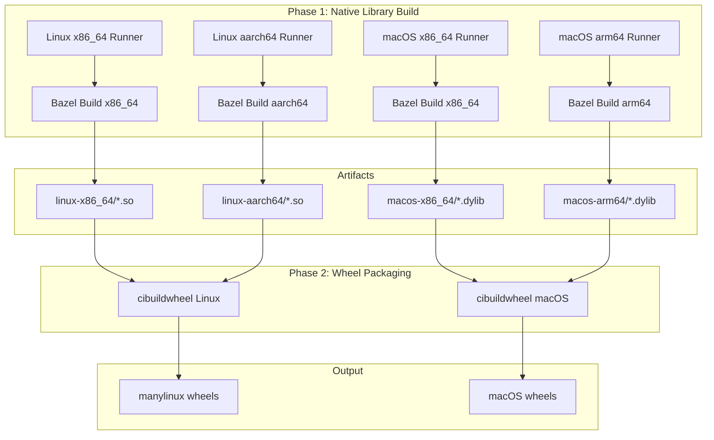
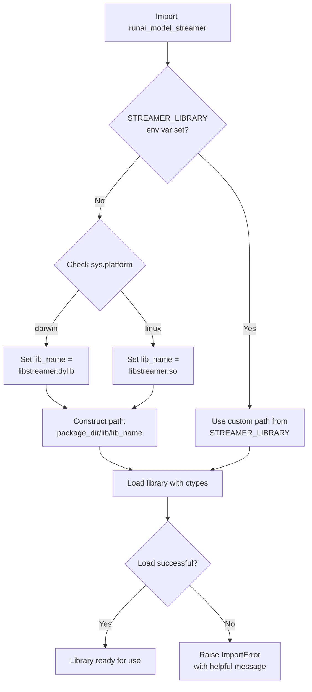

# Design: Multi-Platform Wheel Builds with cibuildwheel

**Issue:** #1  
**Status:** Proposed  
**Author:** KAI Agent  
**Created:** 2026-02-19

---

## Table of Contents

- [Summary](#summary)
- [Motivation](#motivation)
- [Proposal](#proposal)
- [Design Details](#design-details)
  - [Current Architecture](#current-architecture)
  - [Approach: Hybrid Build with cibuildwheel](#approach-hybrid-build-with-cibuildwheel)
  - [Architecture Overview](#architecture-overview)
  - [Implementation Details](#implementation-details)
  - [Native Library Loading Changes](#native-library-loading-changes)
  - [Library Loading Flow](#library-loading-flow)
- [Backward Compatibility](#backward-compatibility)
- [Alternatives Considered](#alternatives-considered)
- [Test Plan](#test-plan)
  - [Unit Tests](#unit-tests)
  - [Integration Tests](#integration-tests)
  - [End-to-End Tests](#end-to-end-tests)
  - [Coverage Goals](#coverage-goals)
- [Graduation Criteria](#graduation-criteria)
- [Migration Plan](#migration-plan)
- [Rollback Plan](#rollback-plan)
- [Risks and Mitigations](#risks-and-mitigations)
- [Implementation History](#implementation-history)
- [References](#references)

---

## Summary

This design proposes adopting cibuildwheel as the standard tool for building Python wheels across multiple platforms. The implementation uses a hybrid build approach: native C++ libraries are compiled on platform-specific runners, then cibuildwheel packages them into wheels. This enables macOS support while maintaining existing Linux compatibility and simplifying the release workflow.

## Motivation

### Problem Statement

The runai-model-streamer package currently only builds wheels for Linux platforms (manylinux2014_x86_64 and manylinux2014_aarch64). Users on macOS cannot install the package:

```
No solution found when resolving dependencies:
  ╰─▶ Because all versions of runai-model-streamer have no wheels with a matching 
      platform tag (e.g., `macosx_15_0_arm64`) and you require runai-model-streamer, 
      we can conclude that your requirements are unsatisfiable.
```

The current build system uses a custom devcontainer with manually compiled cross-compilation toolchains and statically linked dependencies. This approach is complex, hard to maintain, and doesn't support macOS or Windows platforms.

### Goals

1. **Support macOS wheels** - Build wheels for macOS x86_64 and arm64 (Apple Silicon)
2. **Standardize build tooling** - Use cibuildwheel as the standard Python wheel build tool
3. **Maintain Linux support** - Continue supporting manylinux2014 for x86_64 and aarch64
4. **Simplify CI/CD** - Reduce complexity in the release workflow
5. **Preserve native library compatibility** - Ensure libstreamer.so and cloud provider libraries work correctly

### Non-Goals

1. **Windows support** - Not in scope for this design (can be added later)
2. **musllinux support** - Alpine Linux support is not required currently
3. **Changing the C++ build system** - Bazel remains the C++ build tool
4. **Pure Python fallback** - The native library is required for performance

## Proposal

We propose implementing a **hybrid build strategy** that separates native library compilation from wheel packaging:

1. **Phase 1: Build native libraries** - Use platform-specific runners to compile C++ libraries with Bazel
2. **Phase 2: Package wheels** - Use cibuildwheel to package the pre-built libraries into platform-specific wheels

This approach:
- Leverages cibuildwheel's mature wheel packaging capabilities
- Maintains control over the complex C++ compilation environment
- Enables natural macOS support through native compilation
- Reuses the existing Bazel build infrastructure

## Design Details

### Current Architecture

```
┌─────────────────────────────────────────────────────────────────┐
│                     devcontainer (Ubuntu 20.04)                  │
├─────────────────────────────────────────────────────────────────┤
│  Pre-built static libraries:                                     │
│  ├── /opt/x86_64-ssl, /opt/aarch64-ssl (OpenSSL 3.5.0)         │
│  ├── /opt/x86_64-curl, /opt/aarch64-curl (curl 8.13.0)         │
│  ├── /opt/x86_64-zlib, /opt/aarch64-zlib (zlib 1.3.1)          │
│  ├── /opt/x86_64-aws, /opt/aarch64-aws (AWS SDK C++)           │
│  ├── /opt/x86_64-azure, /opt/aarch64-azure (Azure SDK C++)     │
│  └── /opt/x86_64-xml2, /opt/aarch64-xml2 (libxml2)             │
├─────────────────────────────────────────────────────────────────┤
│  Bazel build:                                                    │
│  ├── libstreamer.so (core library)                              │
│  ├── libstreamers3.so (S3 backend)                              │
│  ├── libstreamergcs.so (GCS backend)                            │
│  └── libstreamerazure.so (Azure backend)                        │
├─────────────────────────────────────────────────────────────────┤
│  Python wheels (setup.py bdist_wheel):                          │
│  ├── runai-model-streamer (bundles libstreamer.so)              │
│  ├── runai-model-streamer-s3 (bundles libstreamers3.so)         │
│  ├── runai-model-streamer-gcs (bundles libstreamergcs.so)       │
│  └── runai-model-streamer-azure (bundles libstreamerazure.so)   │
└─────────────────────────────────────────────────────────────────┘
```

### Python Package Structure

```
py/
├── runai_model_streamer/           # Core package with libstreamer.so
│   ├── setup.py
│   └── runai_model_streamer/
│       └── libstreamer/
│           └── lib/
│               └── libstreamer.so  # Native library (copied from cpp/bazel-bin)
├── runai_model_streamer_s3/        # S3 extension
├── runai_model_streamer_gcs/       # GCS extension  
└── runai_model_streamer_azure/     # Azure extension
```

### Approach: Hybrid Build with cibuildwheel

The key insight is that we need to **separate native library compilation from wheel packaging**:

1. **Phase 1: Build native libraries** - Use platform-specific runners to compile C++ libraries
2. **Phase 2: Package wheels** - Use cibuildwheel to package the pre-built libraries into wheels

This approach is necessary because:
- cibuildwheel's manylinux containers cannot easily include our complex C++ dependencies
- macOS builds require native compilation on macOS runners
- Pre-building libraries gives us control over the compilation environment

### Architecture Overview



### Implementation Details

#### 1. Project Configuration (pyproject.toml)

Migrate from `setup.py` to `pyproject.toml` for modern Python packaging:

```toml
# py/runai_model_streamer/pyproject.toml
[build-system]
requires = ["setuptools>=61.0", "wheel"]
build-backend = "setuptools.build_meta"

[project]
name = "runai-model-streamer"
dynamic = ["version"]
description = "High-performance model streaming library"
license = {text = "Apache-2.0"}
requires-python = ">=3.9"
dependencies = [
    "torch>=2.0.0,<3.0.0",
    "humanize",
    "numpy",
]

[project.optional-dependencies]
s3 = ["runai-model-streamer-s3"]
gcs = ["runai-model-streamer-gcs"]
azure = ["runai-model-streamer-azure"]

[tool.setuptools.packages.find]
where = ["."]

[tool.setuptools.package-data]
"runai_model_streamer.libstreamer" = ["lib/*.so", "lib/*.dylib"]

[tool.setuptools.dynamic]
version = {env = "PACKAGE_VERSION", default = "0.0.0"}
```

#### 2. cibuildwheel Configuration

```toml
# pyproject.toml (root level, for cibuildwheel)
[tool.cibuildwheel]
# Skip builds we don't support
skip = [
    "pp*",           # No PyPy support
    "*-win32",       # No 32-bit Windows
    "*-musllinux*",  # No Alpine Linux
    "*i686*",        # No 32-bit Linux
]

# Build for Python 3.9-3.12 (3.8 dropped - see Decision Log)
build = "cp39-* cp310-* cp311-* cp312-*"

[tool.cibuildwheel.linux]
# Use manylinux2014 for broad compatibility
manylinux-x86_64-image = "manylinux2014"
manylinux-aarch64-image = "manylinux2014"

# Run auditwheel to verify/repair wheels
repair-wheel-command = "auditwheel repair -w {dest_dir} {wheel}"

# Environment for build
environment = { PACKAGE_VERSION = "{env:PACKAGE_VERSION:0.0.0}" }

# Before build: copy pre-built native libraries
before-build = [
    "mkdir -p {package}/runai_model_streamer/libstreamer/lib",
    "cp /native-libs/linux-{arch}/*.so {package}/runai_model_streamer/libstreamer/lib/",
]

[tool.cibuildwheel.macos]
# Build separate wheels per architecture (see Decision Log)
archs = ["x86_64", "arm64"]

# Repair with delocate
repair-wheel-command = "delocate-wheel --require-archs {delocate_archs} -w {dest_dir} {wheel}"

environment = { PACKAGE_VERSION = "{env:PACKAGE_VERSION:0.0.0}" }

before-build = [
    "mkdir -p {package}/runai_model_streamer/libstreamer/lib",
    "cp /native-libs/macos-{arch}/*.dylib {package}/runai_model_streamer/libstreamer/lib/",
]
```

#### 3. GitHub Actions Workflow

```yaml
# .github/workflows/on-release.yaml
name: Build and Release

on:
  release:
    types: [created]

env:
  PACKAGE_VERSION: ${{ github.ref_name }}

jobs:
  # Phase 1: Build native libraries
  build-native-linux:
    name: Build Native Libraries (Linux)
    strategy:
      matrix:
        arch: [x86_64, aarch64]
    runs-on: ${{ matrix.arch == 'aarch64' && 'ubuntu-24.04-arm' || 'ubuntu-latest' }}
    container:
      image: ghcr.io/${{ github.repository }}/build-env:latest
    steps:
      - uses: actions/checkout@v4
      
      - name: Build C++ libraries
        run: |
          cd cpp
          bazel build streamer:libstreamer.so --config=${{ matrix.arch }}
          bazel build s3:libstreamers3.so --config=${{ matrix.arch }}
          bazel build gcs:libstreamergcs.so --config=${{ matrix.arch }}
          bazel build azure:libstreamerazure.so --config=${{ matrix.arch }}
      
      - name: Collect artifacts
        run: |
          mkdir -p native-libs/linux-${{ matrix.arch }}
          cp cpp/bazel-bin/streamer/libstreamer.so native-libs/linux-${{ matrix.arch }}/
          cp cpp/bazel-bin/s3/libstreamers3.so native-libs/linux-${{ matrix.arch }}/
          cp cpp/bazel-bin/gcs/libstreamergcs.so native-libs/linux-${{ matrix.arch }}/
          cp cpp/bazel-bin/azure/libstreamerazure.so native-libs/linux-${{ matrix.arch }}/
      
      - uses: actions/upload-artifact@v4
        with:
          name: native-libs-linux-${{ matrix.arch }}
          path: native-libs/

  build-native-macos:
    name: Build Native Libraries (macOS)
    strategy:
      matrix:
        include:
          - arch: x86_64
            runner: macos-13
          - arch: arm64
            runner: macos-14
    runs-on: ${{ matrix.runner }}
    steps:
      - uses: actions/checkout@v4
      
      - name: Install dependencies
        run: |
          brew install bazelisk openssl@3 curl
      
      - name: Build C++ libraries
        run: |
          cd cpp
          bazel build streamer:libstreamer.so
          bazel build s3:libstreamers3.so
          bazel build gcs:libstreamergcs.so
          bazel build azure:libstreamerazure.so
        env:
          # Point to Homebrew OpenSSL
          OPENSSL_ROOT_DIR: /opt/homebrew/opt/openssl@3
      
      - name: Collect artifacts
        run: |
          mkdir -p native-libs/macos-${{ matrix.arch }}
          # Note: On macOS, .so files are actually .dylib
          cp cpp/bazel-bin/streamer/libstreamer.so native-libs/macos-${{ matrix.arch }}/libstreamer.dylib
          cp cpp/bazel-bin/s3/libstreamers3.so native-libs/macos-${{ matrix.arch }}/libstreamers3.dylib
          cp cpp/bazel-bin/gcs/libstreamergcs.so native-libs/macos-${{ matrix.arch }}/libstreamergcs.dylib
          cp cpp/bazel-bin/azure/libstreamerazure.so native-libs/macos-${{ matrix.arch }}/libstreamerazure.dylib
      
      - uses: actions/upload-artifact@v4
        with:
          name: native-libs-macos-${{ matrix.arch }}
          path: native-libs/

  # Phase 2: Build wheels with cibuildwheel
  build-wheels:
    name: Build Wheels
    needs: [build-native-linux, build-native-macos]
    strategy:
      matrix:
        os: [ubuntu-latest, macos-13, macos-14]
    runs-on: ${{ matrix.os }}
    steps:
      - uses: actions/checkout@v4
      
      - name: Download all native libraries
        uses: actions/download-artifact@v4
        with:
          pattern: native-libs-*
          path: native-libs/
          merge-multiple: true
      
      - name: Set up Python
        uses: actions/setup-python@v5
        with:
          python-version: "3.11"
      
      - name: Install cibuildwheel
        run: python -m pip install cibuildwheel==2.21.0
      
      - name: Build wheels (runai-model-streamer)
        run: python -m cibuildwheel --output-dir wheelhouse py/runai_model_streamer
        env:
          CIBW_ENVIRONMENT: "NATIVE_LIBS_PATH=${{ github.workspace }}/native-libs PACKAGE_VERSION=${{ env.PACKAGE_VERSION }}"
      
      - name: Build wheels (runai-model-streamer-s3)
        run: python -m cibuildwheel --output-dir wheelhouse py/runai_model_streamer_s3
        env:
          CIBW_ENVIRONMENT: "NATIVE_LIBS_PATH=${{ github.workspace }}/native-libs PACKAGE_VERSION=${{ env.PACKAGE_VERSION }}"
      
      - name: Build wheels (runai-model-streamer-gcs)
        run: python -m cibuildwheel --output-dir wheelhouse py/runai_model_streamer_gcs
        env:
          CIBW_ENVIRONMENT: "NATIVE_LIBS_PATH=${{ github.workspace }}/native-libs PACKAGE_VERSION=${{ env.PACKAGE_VERSION }}"
      
      - name: Build wheels (runai-model-streamer-azure)
        run: python -m cibuildwheel --output-dir wheelhouse py/runai_model_streamer_azure
        env:
          CIBW_ENVIRONMENT: "NATIVE_LIBS_PATH=${{ github.workspace }}/native-libs PACKAGE_VERSION=${{ env.PACKAGE_VERSION }}"
      
      - uses: actions/upload-artifact@v4
        with:
          name: wheels-${{ matrix.os }}
          path: wheelhouse/*.whl

  # Phase 3: Publish to PyPI
  publish:
    name: Publish to PyPI
    needs: [build-wheels]
    runs-on: ubuntu-latest
    steps:
      - name: Download all wheels
        uses: actions/download-artifact@v4
        with:
          pattern: wheels-*
          path: dist/
          merge-multiple: true
      
      - name: Publish to PyPI
        uses: pypa/gh-action-pypi-publish@release/v1
        with:
          password: ${{ secrets.PYPI_API_TOKEN }}
          packages-dir: dist/
```

### Native Library Loading Changes

Update the Python code to handle both `.so` (Linux) and `.dylib` (macOS):

```python
# py/runai_model_streamer/runai_model_streamer/libstreamer/__init__.py
import os
import sys
import ctypes

def _get_library_path():
    """Get the path to the native library based on platform."""
    lib_dir = os.path.join(os.path.dirname(os.path.abspath(__file__)), "lib")
    
    if sys.platform == "darwin":
        lib_name = "libstreamer.dylib"
    else:
        lib_name = "libstreamer.so"
    
    return os.path.join(lib_dir, lib_name)

DEFAULT_STREAMER_LIBRARY = _get_library_path()
STREAMER_LIBRARY = os.environ.get("STREAMER_LIBRARY", DEFAULT_STREAMER_LIBRARY)

# ... rest of the file unchanged
```

### Library Loading Flow

The following diagram illustrates how the native library is located and loaded at runtime:



## Backward Compatibility

This section addresses how the changes maintain compatibility with existing users and deployments.

### API Compatibility

- **Python API unchanged**: All existing Python code using `runai_model_streamer` will work without modification
- **Function signatures preserved**: No changes to public function or class interfaces
- **Import paths unchanged**: `import runai_model_streamer` and all submodules work identically

### Environment Variable Compatibility

- **`STREAMER_LIBRARY` preserved**: Users who set this environment variable to use a custom library path will continue to work exactly as before
- **No new required variables**: The change introduces no mandatory new configuration

### Wheel Compatibility

| Aspect | Before | After | User Impact |
|--------|--------|-------|-------------|
| Linux x86_64 | ✅ Available | ✅ Available | None |
| Linux aarch64 | ✅ Available | ✅ Available | None |
| macOS x86_64 | ❌ Not available | ✅ **NEW** | Enables new users |
| macOS arm64 | ❌ Not available | ✅ **NEW** | Enables new users |
| Wheel naming | manylinux2014 | manylinux2014 | None |

### Version Compatibility

- **Semantic versioning continues**: Version 0.14.0 follows from 0.13.x
- **No breaking changes**: This is a minor version bump, not major
- **Existing pinned versions remain**: Users with `runai-model-streamer<0.14.0` continue to get existing wheels from PyPI

### Migration Path

| User Type | Required Action | Notes |
|-----------|-----------------|-------|
| Linux users | **None** | Existing workflows unchanged |
| macOS users | **None** | Can now `pip install` where previously impossible |
| Users with pinned versions | **None** | Old versions remain available on PyPI |
| Users with custom `STREAMER_LIBRARY` | **None** | Environment variable continues to work |
| CI/CD pipelines | **None** | `pip install runai-model-streamer` works identically |

### Wheel Size Comparison

Users downloading wheels will see similar sizes to existing releases:

| Platform | Estimated Wheel Size | Notes |
|----------|---------------------|-------|
| manylinux2014_x86_64 | ~15 MB | Unchanged from current |
| manylinux2014_aarch64 | ~14 MB | Unchanged from current |
| macosx_10_9_x86_64 | ~12 MB | **NEW** - Smaller due to different linking |
| macosx_11_0_arm64 | ~11 MB | **NEW** - Apple Silicon optimized |

## Alternatives Considered

### Alternative 1: Pure cibuildwheel with In-Container Builds

**Description:** Use cibuildwheel's `before-all` hook to compile C++ dependencies inside manylinux containers.

**Pros:**
- Simpler workflow (single phase)
- No need to manage artifacts between jobs

**Cons:**
- Very complex to set up AWS SDK, Azure SDK builds in manylinux containers
- Long build times (rebuilding dependencies for each wheel)
- macOS builds would still need separate handling
- No good solution for cross-compilation

**Decision:** Rejected due to complexity of building cloud SDK dependencies in manylinux containers.

### Alternative 2: Pre-built Dependency Containers

**Description:** Create custom manylinux images with all dependencies pre-installed.

**Pros:**
- Faster builds (dependencies pre-compiled)
- Works with standard cibuildwheel

**Cons:**
- Need to maintain custom container images
- Container images would be very large (~5GB+)
- Still doesn't solve macOS support
- Registry costs for large images

**Decision:** Rejected. The custom container approach is essentially what we have today but with different tooling.

### Alternative 3: Hybrid Build (Selected)

**Description:** Build native libraries separately on platform-specific runners, then use cibuildwheel for wheel packaging.

**Pros:**
- Clean separation of concerns
- Native compilation on target platforms
- Simpler cibuildwheel configuration
- Reuses existing Bazel build system
- Supports macOS naturally

**Cons:**
- More complex workflow (multiple phases)
- Need to manage artifacts between jobs
- Longer total CI time due to sequential phases

**Decision:** Selected. This approach provides the best balance of maintainability, platform support, and build reliability.

## Test Plan

### Unit Tests

- **Library loading tests**: Verify correct library path resolution on each platform
- **Platform detection tests**: Test `.so` vs `.dylib` selection logic
- **Mock library tests**: Existing tests with `STREAMER_LIBRARY` override continue to work

```python
# test_platform_loading.py
import sys
import unittest
from unittest.mock import patch

class TestPlatformLoading(unittest.TestCase):
    def test_darwin_loads_dylib(self):
        with patch.object(sys, 'platform', 'darwin'):
            from runai_model_streamer.libstreamer import _get_library_path
            path = _get_library_path()
            self.assertTrue(path.endswith('.dylib'))
    
    def test_linux_loads_so(self):
        with patch.object(sys, 'platform', 'linux'):
            from runai_model_streamer.libstreamer import _get_library_path
            path = _get_library_path()
            self.assertTrue(path.endswith('.so'))
    
    def test_streamer_library_env_override(self):
        custom_path = "/custom/path/libstreamer.so"
        with patch.dict(os.environ, {"STREAMER_LIBRARY": custom_path}):
            # Re-import to pick up env var
            import importlib
            import runai_model_streamer.libstreamer as lib
            importlib.reload(lib)
            self.assertEqual(lib.STREAMER_LIBRARY, custom_path)
```

### Integration Tests

- **Wheel installation tests**: Install built wheels and verify import works
- **auditwheel verification**: Ensure manylinux compliance
- **delocate verification**: Ensure macOS wheels are properly bundled

```bash
# Test wheel on clean environment
python -m venv test-env
source test-env/bin/activate
pip install wheelhouse/runai_model_streamer-*.whl
python -c "import runai_model_streamer; print('OK')"
```

### End-to-End Tests

- **Cross-platform CI matrix**: Test wheels on multiple OS/Python combinations
- **Cloud provider tests**: S3, GCS, Azure backends work on all platforms

```yaml
# .github/workflows/test-wheels.yaml
jobs:
  test:
    strategy:
      matrix:
        os: [ubuntu-latest, ubuntu-24.04-arm, macos-13, macos-14]
        python: ["3.9", "3.10", "3.11", "3.12"]
    runs-on: ${{ matrix.os }}
    steps:
      - name: Install wheel
        run: pip install wheelhouse/runai_model_streamer-*.whl
      - name: Run import test
        run: python -c "import runai_model_streamer"
      - name: Run basic functionality test
        run: python -c "from runai_model_streamer import StreamerConfig; print('Config OK')"
```

### Coverage Goals

| Metric | Current (v0.13.0) | Target (v0.14.0) | Notes |
|--------|-------------------|------------------|-------|
| Overall coverage | 75% | >80% | Add platform-specific tests |
| Library loading | 60% | 95% | New cross-platform logic |
| Cloud backends | 80% | 80% | Maintained |

**Coverage additions:**
- Platform detection tests (+3% estimated)
- Library path resolution tests (+2% estimated)
- Error handling for missing libraries (+1% estimated)

## Graduation Criteria

### Alpha (v0.14.0-alpha.1)

- [ ] Native library builds successfully on all 4 platforms
- [ ] cibuildwheel configuration complete
- [ ] Wheels build without errors
- [ ] Basic import test passes on all platforms

### Beta (v0.14.0-beta.1)

- [ ] Full test suite passes on all platforms
- [ ] auditwheel/delocate repair successful
- [ ] Cloud provider backends tested on macOS
- [ ] Documentation updated

### Stable (v0.14.0)

- [ ] Wheels published to PyPI
- [ ] Installation verified on clean environments
- [ ] No regressions from v0.13.x
- [ ] Performance benchmarks within acceptable range

## Migration Plan

### Phase 1: Setup (Week 1)
1. Create `pyproject.toml` files for all packages
2. Update library loading code for cross-platform support
3. Create initial cibuildwheel configuration

### Phase 2: macOS Support (Week 2)
1. Set up Bazel builds on macOS runners
2. Install required dependencies via Homebrew
3. Test native library compilation on macOS

### Phase 3: Integration (Week 3)
1. Create new GitHub Actions workflow
2. Test full build pipeline on a branch
3. Verify wheels install correctly on all platforms

### Phase 4: Rollout (Week 4)
1. Merge changes to main
2. Create test release (e.g., 0.14.0-rc1)
3. Verify PyPI upload works
4. Release stable version

## Rollback Plan

If issues are discovered post-release, the following rollback procedure will be executed:

### Immediate Response (< 1 hour)

1. **Yank affected wheels from PyPI**
   ```bash
   # Yank specific problematic wheels
   pip index yank runai-model-streamer 0.14.0 --platform macosx_11_0_arm64
   ```

2. **Post GitHub issue** documenting:
   - Affected versions and platforms
   - Symptoms users may experience
   - Workaround (pin to previous version)

### Short-term Recovery (< 24 hours)

3. **Re-publish previous stable wheels**
   ```bash
   # If necessary, republish 0.13.x wheels
   twine upload dist/runai_model_streamer-0.13.1-*.whl
   ```

4. **Communicate via channels**:
   - GitHub release notes updated
   - PyPI project description updated

### Investigation & Fix

5. **Root cause analysis**
   - Collect error reports from users
   - Reproduce issue in CI
   - Identify fix

6. **Publish fixed version** (0.14.1)
   - Apply fix
   - Full test cycle
   - Staged rollout (test PyPI first)

## Risks and Mitigations

| Risk | Impact | Likelihood | Current | Projected | Mitigation |
|------|--------|------------|---------|-----------|------------|
| macOS Bazel build fails with SDK dependencies | High | Medium | N/A | Phase 2 | Test extensively on macOS; use Homebrew for dependency management |
| Increased CI time | Low | High | ~15 min | ~30 min | Parallelize native builds across 4 runners; leverage Bazel remote cache |
| auditwheel/delocate repair fails | Medium | Low | N/A | Phase 2 | Test repair step early; ensure all dependencies are statically linked |
| GitHub Actions runner availability (aarch64) | Medium | Low | N/A | Ongoing | Use self-hosted runners as fallback; consider BuildJet runners |
| Wheel size increases significantly | Low | Low | ~15 MB | ~15 MB | Monitor wheel sizes; strip debug symbols |

## Decision Log

This section documents key design decisions made during the design phase.

### Decision 1: Drop Python 3.8 Support

**Decision:** Support Python 3.9-3.12, dropping Python 3.8

**Rationale:**
- Python 3.8 reached end-of-life (EOL) in October 2024
- PyTorch 2.2+ has already dropped Python 3.8 support
- Our `torch>=2.0.0` dependency aligns with this decision
- Reduces CI matrix complexity (20% fewer wheel builds)

**Impact:** Users on Python 3.8 must upgrade to Python 3.9+ or pin to runai-model-streamer<0.14.0

### Decision 2: Separate Architecture Wheels (Not Universal2)

**Decision:** Build separate macOS wheels for x86_64 and arm64 instead of universal2

**Rationale:**
- Separate wheels are ~50% smaller per download
- Users only download the architecture they need
- Simpler to debug architecture-specific issues
- Native libraries are compiled separately anyway

**Trade-off:** Users on mixed-architecture systems (rare) need separate installs

### Decision 3: Homebrew for macOS Dependencies

**Decision:** Use Homebrew for macOS C++ dependencies (OpenSSL, curl)

**Rationale:**
- Homebrew is the standard macOS package manager
- Pre-built binaries are faster than compiling from source
- Well-tested on both Intel and Apple Silicon Macs
- vcpkg would require additional setup and maintenance

**Trade-off:** Slight version inconsistency possible between Homebrew updates

## Implementation History

| Date | Milestone | Notes |
|------|-----------|-------|
| 2026-02-19 | Design document created | Initial proposal |
| TBD | Design approved | Pending review |
| TBD | Phase 1 complete | Setup and configuration |
| TBD | Phase 2 complete | macOS support added |
| TBD | Phase 3 complete | Integration tested |
| TBD | v0.14.0 released | Stable release |

## Examples

### Example 1: Installing on macOS Apple Silicon

```bash
# Before (fails)
$ pip install runai-model-streamer
ERROR: No matching distribution found for runai-model-streamer

# After (works)
$ pip install runai-model-streamer
Successfully installed runai-model-streamer-0.14.0
```

### Example 2: Installing with S3 Support on macOS

```bash
$ pip install "runai-model-streamer[s3]"
Successfully installed runai-model-streamer-0.14.0 runai-model-streamer-s3-0.14.0
```

### Example 3: Available Wheels After Implementation

```
runai_model_streamer-0.14.0-cp39-cp39-manylinux2014_x86_64.whl
runai_model_streamer-0.14.0-cp39-cp39-manylinux2014_aarch64.whl
runai_model_streamer-0.14.0-cp39-cp39-macosx_10_9_x86_64.whl
runai_model_streamer-0.14.0-cp39-cp39-macosx_11_0_arm64.whl
runai_model_streamer-0.14.0-cp310-cp310-manylinux2014_x86_64.whl
runai_model_streamer-0.14.0-cp310-cp310-manylinux2014_aarch64.whl
runai_model_streamer-0.14.0-cp310-cp310-macosx_10_9_x86_64.whl
runai_model_streamer-0.14.0-cp310-cp310-macosx_11_0_arm64.whl
runai_model_streamer-0.14.0-cp311-cp311-manylinux2014_x86_64.whl
runai_model_streamer-0.14.0-cp311-cp311-manylinux2014_aarch64.whl
runai_model_streamer-0.14.0-cp311-cp311-macosx_10_9_x86_64.whl
runai_model_streamer-0.14.0-cp311-cp311-macosx_11_0_arm64.whl
runai_model_streamer-0.14.0-cp312-cp312-manylinux2014_x86_64.whl
runai_model_streamer-0.14.0-cp312-cp312-manylinux2014_aarch64.whl
runai_model_streamer-0.14.0-cp312-cp312-macosx_10_9_x86_64.whl
runai_model_streamer-0.14.0-cp312-cp312-macosx_11_0_arm64.whl
```

### Example 4: PR Workflow Output

```yaml
# .github/workflows/on-pr.yaml changes
- name: Build test wheels
  run: |
    python -m cibuildwheel --output-dir wheelhouse py/runai_model_streamer
  env:
    # Only build for current platform during PR checks
    CIBW_BUILD: "cp311-*"
    CIBW_ARCHS_LINUX: "native"
    CIBW_ARCHS_MACOS: "native"
```

### Example 5: Local Development Build

```bash
# Build native library locally
cd cpp
bazel build streamer:libstreamer.so

# Copy to Python package
cp bazel-bin/streamer/libstreamer.so ../py/runai_model_streamer/runai_model_streamer/libstreamer/lib/

# Build wheel locally
cd ../py/runai_model_streamer
pip wheel . -w dist/
```

## References

- [cibuildwheel documentation](https://cibuildwheel.pypa.io/)
- [manylinux specification](https://github.com/pypa/manylinux)
- [auditwheel](https://github.com/pypa/auditwheel)
- [delocate](https://github.com/matthew-brett/delocate)
- [Python Packaging User Guide](https://packaging.python.org/)
- [PEP 517 - Build system interface](https://peps.python.org/pep-0517/)
- [PEP 621 - Project metadata in pyproject.toml](https://peps.python.org/pep-0621/)

---
*Designed by KAI Agent*
