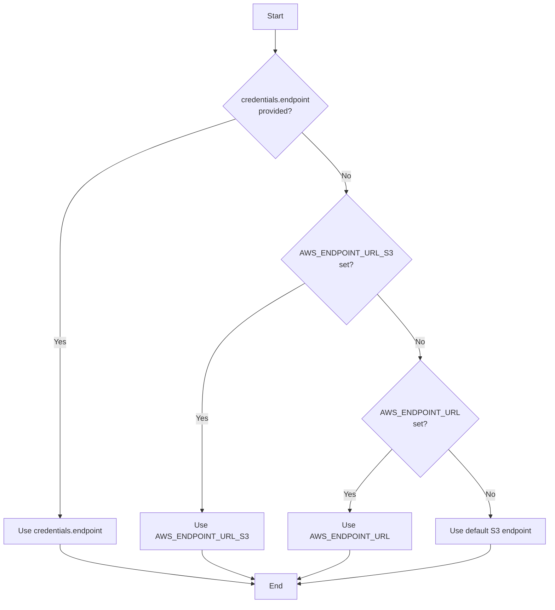

# Design: Support AWS_ENDPOINT_URL_S3 Environment Variable

**Issue:** #6  
**Author:** KAI Agent  
**Status:** Draft  
**Created:** 2026-02-21

## Problem Statement

The AWS SDK supports a service-specific endpoint override environment variable `AWS_ENDPOINT_URL_S3` that takes precedence over the generic `AWS_ENDPOINT_URL` for S3 operations. Currently, the runai-model-streamer only reads `AWS_ENDPOINT_URL`, which doesn't align with AWS SDK conventions and limits flexibility for users who need different endpoints for different AWS services.

When both `AWS_ENDPOINT_URL_S3` and `AWS_ENDPOINT_URL` are set:
- `AWS_ENDPOINT_URL_S3` should be used for S3 operations
- `AWS_ENDPOINT_URL` should be used as a fallback

This is the standard AWS SDK behavior and users expect it to work this way.

## Goals

1. Add support for `AWS_ENDPOINT_URL_S3` environment variable
2. Implement correct precedence: `AWS_ENDPOINT_URL_S3` > `AWS_ENDPOINT_URL`
3. Maintain full backward compatibility with existing `AWS_ENDPOINT_URL` usage
4. Update documentation to reflect the new environment variable

## Non-Goals

1. Supporting other service-specific endpoint variables (e.g., `AWS_ENDPOINT_URL_DYNAMODB`)
2. Changing the behavior when endpoint is passed via credentials (programmatic override)
3. Supporting endpoint configuration via AWS config files

## Design

### Implementation Approach

The implementation is straightforward: modify the endpoint resolution logic in `S3ClientWrapper::Params::Params()` to check `AWS_ENDPOINT_URL_S3` first, then fall back to `AWS_ENDPOINT_URL`.

### Code Changes

**File:** `cpp/common/s3_wrapper/s3_wrapper.cc`

Current implementation (lines 27-39):
```cpp
else
{
    std::string endpoint;
    bool override_endpoint = utils::try_getenv("AWS_ENDPOINT_URL", endpoint);
    bool override_endpoint_flag = utils::getenv<bool>("RUNAI_STREAMER_OVERRIDE_ENDPOINT_URL", true);
    if (override_endpoint) // endpoint passed as environment variable
    {
        LOG(DEBUG) << "direct override of url endpoint in client configuration";
        if (override_endpoint_flag)
        {
            _endpoint = endpoint;
        }
        LOG(DEBUG) <<"Using environment variable endpoint " << endpoint << (override_endpoint_flag ? " , using configuration parameter endpointOverride" : "");
    }
}
```

Proposed implementation:
```cpp
else
{
    std::string endpoint;
    // Check AWS_ENDPOINT_URL_S3 first (S3-specific override takes precedence)
    bool override_endpoint = utils::try_getenv("AWS_ENDPOINT_URL_S3", endpoint);
    if (!override_endpoint)
    {
        // Fall back to generic AWS_ENDPOINT_URL
        override_endpoint = utils::try_getenv("AWS_ENDPOINT_URL", endpoint);
    }
    
    bool override_endpoint_flag = utils::getenv<bool>("RUNAI_STREAMER_OVERRIDE_ENDPOINT_URL", true);
    if (override_endpoint) // endpoint passed as environment variable
    {
        LOG(DEBUG) << "direct override of url endpoint in client configuration";
        if (override_endpoint_flag)
        {
            _endpoint = endpoint;
        }
        LOG(DEBUG) << "Using environment variable endpoint " << endpoint 
                   << (override_endpoint_flag ? " , using configuration parameter endpointOverride" : "");
    }
}
```

### Endpoint Resolution Precedence

The complete endpoint resolution order (highest to lowest priority):

1. **Credentials endpoint** (programmatic) - passed via `credentials.endpoint`
2. **AWS_ENDPOINT_URL_S3** (environment) - S3-specific override
3. **AWS_ENDPOINT_URL** (environment) - generic AWS endpoint override
4. **Default S3 endpoint** - AWS default



## Examples

### Example 1: S3-Specific Endpoint (MinIO)

Using `AWS_ENDPOINT_URL_S3` for a local MinIO instance:

```bash
export AWS_ENDPOINT_URL_S3="http://localhost:9000"
export AWS_ACCESS_KEY_ID="minio"
export AWS_SECRET_ACCESS_KEY="miniostorage"
export RUNAI_STREAMER_S3_USE_VIRTUAL_ADDRESSING=0
export AWS_EC2_METADATA_DISABLED=true

# Stream model from MinIO
python -c "from runai_model_streamer import SafetensorsStreamer; ..."
```

### Example 2: Both Variables Set (Mixed Environment)

When running in an environment with multiple AWS services:

```bash
# Generic endpoint for other AWS services (e.g., DynamoDB)
export AWS_ENDPOINT_URL="http://localstack:4566"

# S3-specific endpoint (separate MinIO instance)
export AWS_ENDPOINT_URL_S3="http://minio:9000"

# The streamer will use http://minio:9000 for S3 operations
```

### Example 3: Backward Compatibility

Existing configurations using only `AWS_ENDPOINT_URL` continue to work:

```bash
# Existing setup - still works exactly as before
export AWS_ENDPOINT_URL="https://storage.googleapis.com"
export AWS_ACCESS_KEY_ID="your-access-id"
export AWS_SECRET_ACCESS_KEY="your-secret"
export AWS_EC2_METADATA_DISABLED=true

# Stream from GCS via S3-compatible API
python -c "from runai_model_streamer import SafetensorsStreamer; ..."
```

### Example 4: Programmatic Override Takes Precedence

```python
from runai_model_streamer import SafetensorsStreamer

# Even with AWS_ENDPOINT_URL_S3 set, programmatic endpoint wins
credentials = {
    "endpoint": "http://custom-endpoint:9000",
    "access_key_id": "key",
    "secret_access_key": "secret"
}

# Uses http://custom-endpoint:9000, ignoring environment variables
streamer = SafetensorsStreamer("s3://bucket/model", credentials=credentials)
```

### Example 5: GCS via S3-Compatible API

```bash
export AWS_ENDPOINT_URL_S3="https://storage.googleapis.com"
export AWS_ACCESS_KEY_ID="your-gcs-hmac-access-id"
export AWS_SECRET_ACCESS_KEY="your-gcs-hmac-secret"
export RUNAI_STREAMER_S3_USE_VIRTUAL_ADDRESSING=0
export AWS_EC2_METADATA_DISABLED=true

# Stream model from GCS
```

## Test Strategy

### Unit Tests

Add new test cases to `cpp/common/s3_wrapper/s3_wrapper_test.cc`:

```cpp
TEST_F(S3WrappertTest, Endpoint_S3_Specific_Exists)
{
    auto endpoint = utils::random::string();
    utils::temp::Env endpoint_env("AWS_ENDPOINT_URL_S3", endpoint);

    Credentials credentials_;
    S3ClientWrapper::Params params_(std::make_shared<StorageUri>(uri), credentials_, utils::random::number<size_t>());

    std::vector<common::backend_api::ObjectConfigParam_t> initial_params;
    EXPECT_EQ(params_.to_config(initial_params).endpoint_url, endpoint);
}

TEST_F(S3WrappertTest, Endpoint_S3_Specific_Precedence_Over_Generic)
{
    auto s3_endpoint = utils::random::string();
    auto generic_endpoint = utils::random::string();
    utils::temp::Env s3_endpoint_env("AWS_ENDPOINT_URL_S3", s3_endpoint);
    utils::temp::Env generic_endpoint_env("AWS_ENDPOINT_URL", generic_endpoint);

    Credentials credentials_;
    S3ClientWrapper::Params params_(std::make_shared<StorageUri>(uri), credentials_, utils::random::number<size_t>());

    std::vector<common::backend_api::ObjectConfigParam_t> initial_params;
    // AWS_ENDPOINT_URL_S3 should take precedence
    EXPECT_EQ(params_.to_config(initial_params).endpoint_url, s3_endpoint);
}

TEST_F(S3WrappertTest, Endpoint_Generic_Fallback)
{
    auto generic_endpoint = utils::random::string();
    utils::temp::Env generic_endpoint_env("AWS_ENDPOINT_URL", generic_endpoint);
    // AWS_ENDPOINT_URL_S3 is NOT set

    Credentials credentials_;
    S3ClientWrapper::Params params_(std::make_shared<StorageUri>(uri), credentials_, utils::random::number<size_t>());

    std::vector<common::backend_api::ObjectConfigParam_t> initial_params;
    // Should fall back to AWS_ENDPOINT_URL
    EXPECT_EQ(params_.to_config(initial_params).endpoint_url, generic_endpoint);
}

TEST_F(S3WrappertTest, Endpoint_Credentials_Precedence_Over_S3_Specific)
{
    auto credentials_endpoint = utils::random::string();
    auto s3_endpoint = utils::random::string();
    utils::temp::Env s3_endpoint_env("AWS_ENDPOINT_URL_S3", s3_endpoint);

    Credentials credentials_(nullptr, nullptr, nullptr, nullptr, credentials_endpoint.c_str());
    S3ClientWrapper::Params params_(std::make_shared<StorageUri>(uri), credentials_, utils::random::number<size_t>());

    std::vector<common::backend_api::ObjectConfigParam_t> initial_params;
    // Credentials endpoint should take precedence over environment variables
    EXPECT_EQ(params_.to_config(initial_params).endpoint_url, credentials_endpoint);
}
```

### Integration Tests

Existing integration tests in `tests/s3/test_s3.py` should continue to pass. Optionally add:

```python
def test_s3_endpoint_url_s3_override():
    """Test that AWS_ENDPOINT_URL_S3 takes precedence over AWS_ENDPOINT_URL"""
    # Set both environment variables
    os.environ["AWS_ENDPOINT_URL"] = "http://should-not-be-used:9000"
    os.environ["AWS_ENDPOINT_URL_S3"] = os.getenv("MINIO_ENDPOINT")
    
    # Verify streaming works with the S3-specific endpoint
    # ... test implementation
```

### Test Coverage Goal

- **Target:** >80% coverage for the endpoint resolution logic
- **Critical paths to test:**
  - Only `AWS_ENDPOINT_URL_S3` set
  - Only `AWS_ENDPOINT_URL` set
  - Both set (precedence test)
  - Neither set (default behavior)
  - Credentials endpoint overrides both

## Documentation Updates

### File: `docs/src/env-vars.md`

Add new section after `AWS_ENDPOINT_URL`:

```markdown
### AWS_ENDPOINT_URL_S3

Overrides url endpoint for reading from S3 compatible object store. Takes precedence over `AWS_ENDPOINT_URL` when both are set.

> [!NOTE]
> 
> This is the AWS SDK standard environment variable for S3-specific endpoint override.
> Use this when you need different endpoints for different AWS services.
>
> When both `AWS_ENDPOINT_URL_S3` and `AWS_ENDPOINT_URL` are set, `AWS_ENDPOINT_URL_S3` is used for S3 operations.

#### Values accepted

String

#### Default value

Falls back to `AWS_ENDPOINT_URL` if not set, then to default S3 url endpoint

#### Example

```bash
# Use MinIO for S3, LocalStack for other AWS services
export AWS_ENDPOINT_URL="http://localstack:4566"
export AWS_ENDPOINT_URL_S3="http://minio:9000"
```
```

Update the existing `AWS_ENDPOINT_URL` section to mention the relationship:

```markdown
### AWS_ENDPOINT_URL

Overrides url endpoint for reading from S3 compatible object store.

> [!NOTE]
> 
> Mandatory for S3 compatible e.g. gcs, minio
> 
> Optional if reading from AWS S3
>
> If `AWS_ENDPOINT_URL_S3` is also set, it takes precedence for S3 operations
```

## Backward Compatibility

This change is **fully backward compatible**:

1. **No breaking changes:** Existing configurations using `AWS_ENDPOINT_URL` continue to work exactly as before
2. **Opt-in behavior:** The new `AWS_ENDPOINT_URL_S3` is only used when explicitly set
3. **Default disabled:** When `AWS_ENDPOINT_URL_S3` is not set, behavior is unchanged
4. **Credentials precedence preserved:** Programmatic endpoint override still takes highest priority

## Risks and Mitigations

| Risk | Impact | Likelihood | Mitigation |
|------|--------|------------|------------|
| Users unaware of new precedence | Low | Low | Clear documentation, logging shows which endpoint is used |
| Environment variable conflicts | Low | Low | Follows AWS SDK standard behavior, predictable |
| Test environment issues | Low | Low | Comprehensive unit tests cover all precedence cases |

## Implementation Checklist

- [ ] Modify `cpp/common/s3_wrapper/s3_wrapper.cc` to check `AWS_ENDPOINT_URL_S3` first
- [ ] Add unit tests for all precedence scenarios
- [ ] Update `docs/src/env-vars.md` with new environment variable documentation
- [ ] Update comments in `cpp/s3/s3.h` and `cpp/s3/s3.cc` to mention `AWS_ENDPOINT_URL_S3`
- [ ] Run existing integration tests to verify backward compatibility

## Alternatives Considered

### Alternative 1: Configuration File Support

**Description:** Read endpoint from AWS config file (`~/.aws/config`)

**Pros:**
- More flexible configuration
- Standard AWS pattern

**Cons:**
- Significantly more complex implementation
- Not currently supported for any configuration
- Out of scope for this issue

**Decision:** Rejected - too complex for the stated requirement

### Alternative 2: RUNAI_STREAMER_ENDPOINT_URL_S3

**Description:** Use a custom environment variable name

**Pros:**
- Consistent with other `RUNAI_STREAMER_*` variables

**Cons:**
- Not standard AWS SDK convention
- Users expect AWS SDK variables to work
- Would require additional documentation explaining the non-standard approach

**Decision:** Rejected - following AWS SDK conventions is simpler and more intuitive

## References

- [AWS SDK Environment Variables](https://docs.aws.amazon.com/sdkref/latest/guide/feature-ss-endpoints.html)
- [AWS Service-specific endpoints](https://docs.aws.amazon.com/sdkref/latest/guide/feature-ss-endpoints.html#ss-endpoints-env)
- Issue #6: Support AWS_ENDPOINT_URL_S3

---
*Designed by KAI Agent*
